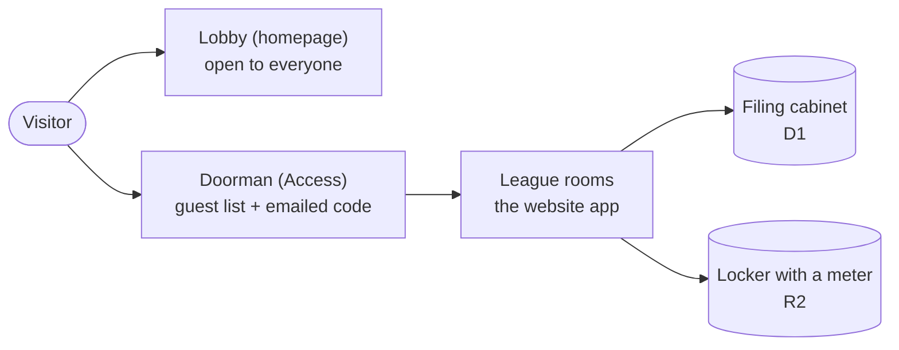
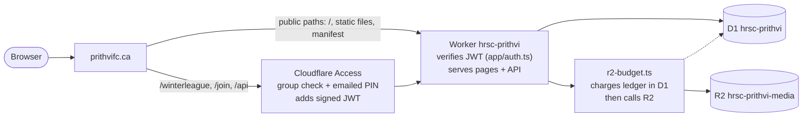
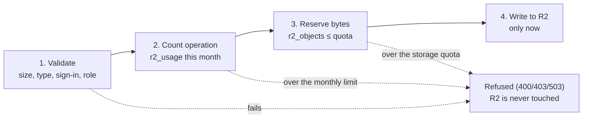
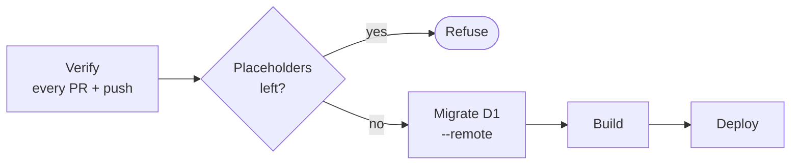

# Prithvi FC on Cloudflare

How the club website moved from ChatGPT Sites to its own Cloudflare account at `prithvifc.ca`, why each piece exists, and how it was set up. The page is written at three levels of detail:

- [Summary](#summary)
- [ELI5](#eli5-explain-it-like-im-five)
- [Full detail](#full-detail)

> **Status, 2 October 2026:** The site is live on Cloudflare at [prithvifc.ca](https://prithvifc.ca). The homepage is public, and `/winterleague`, `/join` and `/api` ask for an emailed sign-in code. Next, the organiser signs in, enters the setup key and sets up the club again. The [to-do list](#11-done-and-still-to-do) shows what's left.

## Summary

- **What moved:** the website, its database and its photo and video storage. They used to run on ChatGPT Sites. Now they run on the club's own Cloudflare account under `prithvifc.ca`.
- **Why:**
  - We wanted our own domain and our own data.
  - We wanted deploys straight from GitHub.
  - We wanted players to sign in with email instead of needing a ChatGPT account.
  - Moving closes a security hole. The old sign-in trusted headers that only ChatGPT's servers set safely, and anywhere else they could be faked.
- **Who can see what:** the homepage is public. The Winter league, invitations and the API need a sign-in by emailed code, and only emails in the "Club members" group can sign in.
- **Cost:** $0. Every Cloudflare service is on its free plan. R2 storage is the only one that would bill past its free allowance, so the app enforces its own limits, set below that allowance.
- **Deploys:** from the `main` branch of [ojdh/HRSC-Prithvi](https://github.com/ojdh/HRSC-Prithvi), by starting the Deploy workflow by hand in GitHub Actions.
- **Data:** starts fresh. Players and media from the old site weren't copied over. Importing them later is possible but hasn't been decided.

| Piece | Cloudflare service | Plan | Status |
|---|---|---|---|
| Domain `prithvifc.ca` | DNS (zone) | Free | Active |
| Website and API | Workers `hrsc-prithvi` | Free | Live on `prithvifc.ca`; `workers.dev` address off |
| Club database | D1 `hrsc-prithvi` | Free | Created, migrations applied |
| Photos and video clips | R2 `hrsc-prithvi-media` | Free tier, app-enforced limits | Created, empty |
| Member sign-in | Zero Trust Access | Free (50 seats) | Application and policy set up |

## ELI5: explain it like I'm five

Think of the website as the club's **clubhouse**.

- **Cloudflare is the building.** We used to rent a room in someone else's building (ChatGPT Sites). Now the club has its own building with its own street address, `prithvifc.ca`, and we hold the keys.
- **The front lobby is open.** Anyone can walk into the lobby, which is the homepage, and see what the club is about.
- **Access is the doorman.** To go past the lobby into the league rooms, the doorman checks your name against a guest list (the "Club members" group). If you're on it, he emails you a one-time code. You type it in and you're in. You don't need to remember a password.
- **D1 is the filing cabinet.** It holds the roster, match results and votes.
- **R2 is the storage locker with a meter.** Photos and video clips go here. The locker is free up to a point. Past that, it starts charging.
- **The guardrail stops the meter.** Before anything goes into or comes out of the locker, the website checks a tally. If the next item would go over the free amount, it says "not this month" instead. Nobody gets a surprise bill.

Why move at all? In the old building, the receptionist trusted anyone wearing a badge with the right name on it. Outside that building, anyone can print a badge. The new doorman checks a signed pass that can't be faked.

The lobby is open. Everything else goes past the doorman first.

## Full detail

### 1. Why leave ChatGPT Sites

The site was built and hosted on ChatGPT Sites. That platform supplied three things:

- the database (a D1 binding called `DB`)
- file storage (an R2 binding called `BUCKET`)
- sign-in: its edge added `oai-authenticated-user-*` headers to each request, and the app read the user from those headers

Four reasons to move:

- **Security.** Those headers are only trustworthy when ChatGPT's own servers set them. Anywhere else, anyone could send `oai-authenticated-user-id: <organiser>` and act as the organiser. The app had to stop trusting them before it could run anywhere else.
- **Ownership.** We wanted our own domain, a database we can export, and deploys from GitHub.
- **Sign-in.** Players shouldn't need a ChatGPT account. An emailed code works for everyone.
- **Cost control.** On our own account, we set the limits ourselves.

### 2. How a request flows now

Public pages never touch Access. Member paths reach the Worker only with a signed token from Access, and the Worker checks that token itself. Every R2 call goes through the budget module, which records it in D1 first (dashed line).

### 3. Sign-in: Cloudflare Access instead of ChatGPT headers

**Why:** Access is Cloudflare's own login gate, it's free for up to 50 users, and it sends the app a token that can't be forged.

**How the app checks the token** (`app/auth.ts`): Access adds a signed token in the `Cf-Access-Jwt-Assertion` header. The Worker:

- checks the token's RS256 signature against the team's public keys at `https://<team>.cloudflareaccess.com/cdn-cgi/access/certs`
- checks the issuer, the audience (AUD tag), the expiry and the not-before time
- uses the token's `sub` as the player's identity

The old `oai-*` headers are ignored. If the team URL or AUD tag is missing, every request is refused. The integration test covers each of these cases:

- forged ChatGPT headers
- a token signed by a different key
- the wrong audience
- the wrong issuer
- an expired token
- a malformed token
- an unsigned token
- missing configuration

**How Access is set up** (Cloudflare dashboard, Zero Trust):

- **Plan:** Zero Trust Free, which has 50 seats.
- **Login method:** One-time PIN. Cloudflare emails a short code that works once, so nobody needs a password.
- **Rule group "Club members":** an Include rule with the Emails selector, listing each member's email (under Access controls → Policies → Rule groups).
- **Self-hosted application "Prithvi FC members":** protects `prithvifc.ca/winterleague`, `/join` and `/api`. Its policy allows the Club members group.

Why only three paths are protected, not the whole site

The first draft put Access in front of the whole site. That would have hidden the public club homepage behind a login. It would probably also have broken "Add to Home Screen", because browsers fetch the app manifest without the login cookie. The homepage reads no member data, so nothing is gained by protecting it.

Why a member list instead of "Everyone"

A seat is taken the first time a person signs in, and it stays taken. With "Everyone", any stranger could request a code and sign in, using up seats the app would never let them use. Strangers could fill all 50 and lock out real players. A members list means only club members ever take a seat. Free seats by removing departed players on the Users page. The app adds a player's email to the group when an admin invites them (see Access sync on invite below).

#### Access sync on invite

**Why:** before this, the organiser had to add each new player's email to the Club members rule group by hand before sending the invite. Now the app does it, but only when an admin invites a player.

**How it works** (`lib/access-sync.ts`, called from `app/api/club/route.ts`):

- An admin creates a placeholder player and enters that person's email on it. Only admins can set or see emails, and only on players who haven't accepted an invitation yet. Each email is lower-cased and can belong to one player.
- **Invite:** when an admin invites a player who has an email, the app reads the Club members group, adds an Emails rule for that address, and writes the group back. Every other rule in the group (the owner's and admins' emails, anything added by hand) is kept as it was. The app then records the address as the player's `accessEmail`. Inviting again doesn't add a duplicate. Invites for players without an email work as before and never call Cloudflare.
- **Changing the email** of an invited player who hasn't joined yet swaps the old address for the new one in the group.
- **Removing (archiving) a player** takes their `accessEmail` out of the group.
- **Emails added by hand stay put.** If an invited player's email is already in the group, the app leaves it unmanaged and never removes it.
- **50-seat cap:** the app refuses an invite that would put more than 50 emails in the group, because the Zero Trust Free plan has 50 seats. Free one by removing a departed member from the group and from the Users page.
- **Failures:** if the Cloudflare call fails, nothing is saved and the admin sees an error. If the club save fails after the group was changed (someone else saved first), the app puts the group back. If `CF_ACCOUNT_ID`, `CF_ACCESS_GROUP_ID` or `CF_API_TOKEN` is missing, inviting a player who has an email fails with "Access sync isn't configured".
- **Logs** record only the HTTP status and email counts, never the token or any email.

**Cloudflare API calls** ([Access groups API](https://developers.cloudflare.com/api/resources/zero_trust/subresources/access/subresources/groups/methods/update/)): `GET` then `PUT` on `https://api.cloudflare.com/client/v4/accounts/{CF_ACCOUNT_ID}/access/groups/{CF_ACCESS_GROUP_ID}` with `Authorization: Bearer <CF_API_TOKEN>`. The PUT body is the group's `name`, `include`, `exclude`, `require` and `is_default`; an email rule is `{"email": {"email": "player@example.com"}}`.

**Setting it up (account owner, once):**

1. **Create the API token.** In the Cloudflare dashboard go to My Profile → API Tokens → Create Token → Custom token. Give it one permission, **Account → Access: Organizations, Identity Providers, and Groups → Edit**, and under Account Resources include **only this club's account**. Don't add any other permission.
2. **Store it as a Worker secret:** `npx wrangler secret put CF_API_TOKEN`, then paste the token. It is never written to the repo or to GitHub.
3. **Find the account ID:** it's shown as "Account ID" on the account's Workers & Pages overview in the dashboard. Put it in `wrangler.jsonc` as `CF_ACCOUNT_ID`.
4. **Find the Club members group ID:** list the account's Access groups with the new token and copy the `id` of the "Club members" group: `curl -s -H "Authorization: Bearer $CF_API_TOKEN" https://api.cloudflare.com/client/v4/accounts/$CF_ACCOUNT_ID/access/groups`. Put it in `wrangler.jsonc` as `CF_ACCESS_GROUP_ID`.
5. Deploy. The Deploy workflow refuses to run while either value is still a `REPLACE_WITH_` placeholder.

Keep the Access policy's Allow rule pointed at the Club members group only, never "Everyone". The app adds only invited emails to that group, so only invited people can take a seat.

### 4. The website itself: a Cloudflare Worker

**Why:** the app was already built to run on Cloudflare: Next.js through vinext, with D1 and R2 bindings. So it runs on Workers with no rewrite.

**How** (`wrangler.jsonc`):

- **Worker name:** `hrsc-prithvi`, built by `pnpm build` into `dist/`.
- **Address:** `routes: [{ pattern: "prithvifc.ca", custom_domain: true }]`. The deploy attaches the domain and creates its DNS record, so there's no clicking around in the dashboard.
- **No second address:** `workers_dev: false` turns off the extra `*.workers.dev` address, so the site lives at exactly one URL.
- **Settings and secrets:** the database ID, Access team URL, AUD tag and R2 limits are plain `vars`, not secrets. The account ID and Club members group ID for Access sync are `vars` too. The two secrets, `CLUB_SETUP_KEY` and `CF_API_TOKEN`, are set separately with `wrangler secret put` and never stored in the repo.

**Plan:** Workers Free allows 100,000 requests a day. Past that, requests are refused rather than billed. On 2 October 2026 the account owner checked Workers & Pages → Plans in the dashboard and confirmed there is no paid Workers plan, so the account is on Workers Free. This was a dashboard check, not an API check.

### 5. The domain

`prithvifc.ca` is a zone on the club's Cloudflare account. It's on the Free plan, uses Cloudflare's nameservers, and its status is active (checked through the Cloudflare API). The domain needs to be on the same account so the Worker can claim it as a custom domain and Access can protect paths on it.

### 6. The database: D1

**Why:** the app stores the club as one JSON document, plus separate tables for vote receipts, anonymous ballots, maintenance records and the R2 ledger. D1 is Cloudflare's SQLite database and the app already used it.

**How:**

- Created with `wrangler d1 create hrsc-prithvi` in Western North America.
- Migrations `0000`–`0003` (in `drizzle/`) applied with `wrangler d1 migrations apply DB --remote`. The Deploy workflow also runs this before every deploy, so a new migration can't be forgotten.
- D1 Free stops at its daily limits instead of billing.

### 7. Photos and videos: R2, and the free-tier guardrail

**Why it needs a guardrail:** R2's free tier covers 10 GB-month of storage, 1 million Class A operations and 10 million Class B operations a month. Past that, R2 bills, and as far as we know Cloudflare offers no hard spending cap for it. It's the only service in this setup that can charge without stopping first, so the app enforces limits itself.

**How** (`lib/r2-budget.ts`, the only code allowed to touch the bucket):

- **`putObject`** (photo or clip upload): adds one Class A operation to this month's count in D1 and reserves the file's bytes in a ledger, then uploads. If either would go past its limit, the upload is refused.
- **`getObject`** (showing a photo, or one video chunk of up to 1 MB): adds one Class B operation first.
- **`deleteObject`**: deleting is free in R2. The ledger row is removed only after R2 confirms the delete, so a failed delete keeps being counted. Over-counting is the safe side.
- **Checks come first:** the file is validated and the user's sign-in and permissions are checked before anything is charged. A bad upload or a stranger costs nothing.
- **Missing limits:** every upload and view is refused (fails closed).

Each check runs before R2 is reached. Views follow the same pattern with a single Class B count.

| Limit (Worker var) | Set to | R2 free tier | What happens at the limit |
|---|---|---|---|
| `R2_STORAGE_QUOTA_BYTES` | 8 GB | 10 GB-month | Uploads refused until a clip is removed |
| `R2_CLASS_A_MONTHLY_LIMIT` | 500,000 | 1,000,000 | Uploads pause until the next UTC month |
| `R2_CLASS_B_MONTHLY_LIMIT` | 5,000,000 | 10,000,000 | Photos and videos pause until the next UTC month |
| Per file (in the routes) | Photo 2 MB, clip 20 MB | n/a | That file is refused |

The gap below the free tier covers anything done outside the app, such as files uploaded by hand from the dashboard, plus any orphaned objects.

**How the rule is kept:**

- `tests/r2-boundary.mjs` fails CI if any file other than `lib/r2-budget.ts` mentions the bucket.
- `AGENTS.md` states the free-tier rules for anyone changing the code, human or AI. `CLAUDE.md` just imports it.
- The integration test runs a deliberately tight budget and checks that each limit is enforced, that refused uploads store nothing, that deletes free up space, and that missing limits fail closed.

**Created as:** bucket `hrsc-prithvi-media` in Western North America, after R2 was turned on in the dashboard. It started with 0 objects, so the ledger matches reality from day one.

**Known limit:** one signed-in player who uploads over and over could use up the month's upload allowance, pausing uploads for everyone until the month ends. It wouldn't cost money, and there are no per-user limits yet.

### 8. Deploying: GitHub Actions

`.github/workflows/deploy.yml`: verify runs everywhere. Everything after it runs only when you start the workflow by hand from `main`.

**Verify** runs on every pull request and every push. It checks:

- the typecheck
- the R2 boundary test
- the build
- the integration test against a local emulator, which never touches production

**Deploy** runs only when started by hand from `main`. It refuses while any `REPLACE_WITH_` placeholder is left in `wrangler.jsonc`, then applies D1 migrations, builds, and runs `wrangler deploy`.

**Repo secrets** on `ojdh/HRSC-Prithvi`:

- `CLOUDFLARE_API_TOKEN`: created from Cloudflare's "Edit Cloudflare Workers" template, plus D1 Edit, scoped to `prithvifc.ca`.
- `CLOUDFLARE_ACCOUNT_ID`.

Both were added in the GitHub UI and are never shown again.

Why deploys come from the fork

The original repo belongs to a different GitHub account (`sujay1059/HRSC-Prithvi`), and we only have read access there. Deploying from `ojdh/HRSC-Prithvi` means we hold the secrets and can start deploys. The self-hosting change is still open on the original repo as PR #1 if its owner wants it.

A bug found before the first deploy

The placeholder check first used `grep REPLACE_WITH_ wrangler.jsonc`. That also matched the explanatory comment at the top of the file, so it would have refused to deploy even with every value filled in. It now skips comment lines and still catches a placeholder anywhere in a value, including inside the team URL. Fixed in PR #2.

### 9. Reviews and checks along the way

- **Self-hosting PR (original repo, #1):** typecheck, build and 101 integration checks passed locally before its CI had ever run. Two fixes were then added on top:
  - keep the homepage public
  - declare the custom domain in code and turn off `workers.dev`
- **Guardrails PR (fork, #1):** the tests were written first and seen to fail. The finished change passes 114 checks (101 existing, 13 new), the boundary test, the typecheck, lint on the changed files, and a dry-run deploy.
  - A Codex adversarial review raised one finding: files already in R2 wouldn't be counted. It was rejected, because the bucket didn't exist yet and was created empty. It would only matter if old media were imported, and the README says what to do in that case.
- **Production settings PR (fork, #2):** CI passed, and the Codex review approved with no findings.
- **Explainer PR (fork, #3):** the Codex review found that this page contradicted itself about whether the Workers plan had been checked. Both places were fixed to say the owner confirmed it in the dashboard.

### 10. What's secret and what isn't

| Value | Secret? | Where it lives |
|---|---|---|
| Cloudflare API token (deploys) | Yes | GitHub repo secret only |
| `CF_API_TOKEN` (Access sync, Access groups edit only) | Yes | Worker secret only |
| `CLUB_SETUP_KEY` | Yes | Worker secret, plus a private file for the organiser |
| Account ID | Not strictly | GitHub repo secret, and `CF_ACCOUNT_ID` in `wrangler.jsonc` for Access sync |
| Club members Access group ID | No | `CF_ACCESS_GROUP_ID` in `wrangler.jsonc` |
| D1 database ID, Access team URL, AUD tag, R2 limits | No | `wrangler.jsonc` (they identify resources and grant no access) |

### 11. Done and still to do

**Done on 2 October 2026:**

- Merged PR #2 (production settings and the placeholder-check fix) into the fork's `main`.
- Ran the Deploy workflow. No migrations were pending, the Worker was uploaded, and `prithvifc.ca` was attached as its custom domain.
- Set `CLUB_SETUP_KEY` as a Worker secret. The only other copy is a private file for the organiser.
- Checked the live site: the homepage returns 200 without sign-in; `/winterleague`, `/join` and `/api/*` redirect to the Access sign-in; the `workers.dev` address is disabled.
- The account owner confirmed in the dashboard (Workers & Pages → Plans) that there is no paid Workers plan, so the account is on Workers Free.

**Still to do:**

- [ ] The organiser signs in at `prithvifc.ca/winterleague`, enters the setup key, rebuilds the squads and sends invitations. Enter each player's email on their placeholder before inviting them; the invite adds it to the Club members rule group.
- [ ] Set up Access sync: create the `CF_API_TOKEN` token, store it with `wrangler secret put`, and fill in `CF_ACCOUNT_ID` and `CF_ACCESS_GROUP_ID` (see Access sync on invite).
- [ ] Decide on the old data. The new site starts empty, so this is a fresh start unless old data is imported from ChatGPT Sites later. Importing would mean remapping player accounts and adding a ledger row for each imported file.
- [ ] Shut down the ChatGPT Sites copy once players have moved over.
- [ ] Separate from Cloudflare: the web app manifest, home-screen icons and service worker are referenced but not in the repo, so "Add to Home Screen" can't install yet.
- [ ] Optional backstop: a usage-based billing alert under Notifications in the Cloudflare dashboard.

---

Maintained in the repo as `docs/cloudflare.html` and `docs/cloudflare.md`, which have the same content. Update both whenever the Cloudflare setup changes. The rules for the free tier are in `AGENTS.md`.
